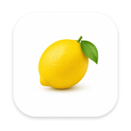

# Lemon

Lemon 是一款原生运行于 macOS 的轻量浏览器。界面由 SwiftUI 与 AppKit 构建，网页渲染完全使用系统 `WKWebView`，不包含 Electron 或 Chromium 内核。

公开仓库：[GitHub](https://github.com/w3345137/lemon-browser) · [Gitee](https://gitee.com/binbin3344/lemon-browser)

项目目标很直接：保留 Safari 级别的系统集成与资源效率，同时提供更接近 Chromium 系浏览器的标签栏、书签栏和日常操作体验。



## 主要功能

- 原生 macOS 窗口、红绿灯、全屏与视频全屏体验
- 标签页常驻：关闭前持续保留对应 `WKWebView`，切回标签无需重新加载
- 固定标签页、关闭标签恢复、标签拖动排序、标签音频状态与单标签静音
- 点击书签或在地址栏回车时使用新标签打开
- 地址栏识别网址；普通文本使用 Bing 搜索
- 地址栏收藏位置选择、书签栏折叠面板、文件夹多列菜单、右键编辑、拖动排序、跨文件夹移动和书签管理器
- 历史记录、下载进度、暂停/继续、文件完整性检查与本地文件删除
- 网站数据与权限管理，包括摄像头、麦克风和通知等权限
- 密码保存与自动填充，凭据存入 macOS Keychain
- 会话 Cookie 加密恢复，尽量保留网站登录状态
- 本地 HTML/XHTML 文件打开与目录资源访问
- 无痕窗口、页面内查找、缩放、内容拦截和设为默认浏览器
- 常用快捷键：`⌘E` 恢复关闭的标签，`⌘1`–`⌘9` 选择标签

## 技术架构

```text
SwiftUI / AppKit
├── 原生窗口与浏览器 Chrome
├── 标签、书签、历史、下载和设置状态
├── Keychain 凭据与加密会话恢复
└── WKWebView
    ├── 系统 WebContent 进程
    ├── 系统 Network 进程
    └── 系统 GPU 进程
```

Lemon 只借鉴行业浏览器公开的交互模式与状态机，不复制 Chromium、Edge 或其他浏览器的专有界面资源。页面引擎和网站兼容能力由 macOS WebKit 提供。

## 系统要求

- macOS 14 或更高版本

当前工程同时构建 Apple Silicon 与 Intel 架构。

## 下载 App

GitHub Release 与 Gitee Release 提供同一份 `Lemon-*-macOS-universal.zip`，同时支持 Apple Silicon 和 Intel Mac。发布包由公开源码自动构建，并附带 `SHA256SUMS.txt`。

公开自动构建采用 ad-hoc 签名，尚未经过 Apple 公证。首次启动时可在 Finder 中右键 Lemon，选择“打开”。

## 无需打开 Xcode 的构建方式

### 云端构建

在 GitHub 仓库的 **Actions → Build Lemon App → Run workflow** 中启动构建。完成后可直接下载 `Lemon-macOS-universal`，无需在本机安装或操作 Xcode。Fork 后同样可以运行这套流程。

推送 `v*` 标签时，同一工作流会创建 GitHub Release；维护者配置 Gitee Token 后，还会把完全相同的 ZIP 和 SHA-256 同步到 Gitee Release。

### 本机一键构建

在 macOS 终端运行：

```bash
./Scripts/build-release.sh
```

脚本会自动完成回归测试、图标生成、`arm64 + x86_64` 通用 App 构建、签名、ZIP 打包和解包验签，输出到：

```bash
deliverables/release/
```

本机构建需要 Apple 的命令行构建工具，但不需要打开 Xcode 工程或进行手工配置。若只需要 `.app` 而不需要 ZIP，可运行：

```bash
LEMON_INSTALL_APP=0 ./Scripts/build-app.sh
```

可通过环境变量指定签名身份：

```bash
LEMON_CODESIGN_IDENTITY="证书 SHA-1 或名称" ./Scripts/build-app.sh
```

没有开发者证书时，脚本会使用 ad-hoc 签名。

## 开源范围

本仓库包含 Lemon 的完整 macOS 原生壳、浏览器界面、标签与书签状态、WebKit 集成、安全存储、构建脚本和发布工作流。运行 App 不依赖私有二进制壳，也没有将核心功能藏在未公开的前端包中。

`Lemon.xcodeproj` 作为苹果原生工程描述文件一并开源；日常下载和构建流程均通过 Release、GitHub Actions 或命令行脚本完成。

## 测试

```bash
./Scripts/run-tests.sh
```

回归覆盖地址栏解析、标签会话、书签移动、文件夹布局、下载完整性、密码捕获/填充、Cookie 保险库、内容拦截、音频状态、WebContent 崩溃恢复和真实 `WKWebView` 焦点切换等场景。

部分 live 测试会启动本机 `localhost` 夹具与临时 `WKWebView`，不会向外部服务上传测试内容。

## 隐私与数据

- 项目没有自有遥测服务或用户账号系统。
- 历史、书签、下载记录和会话快照保存在本机 Application Support。
- 网站密码保存在 macOS Keychain。
- 会话 Cookie 使用 AES-GCM 加密，密钥保存在 macOS Keychain。
- 无痕窗口使用非持久化 `WKWebsiteDataStore`。
- 一次性浏览器迁移桥只监听 `127.0.0.1`，完成后应立即停止接收并移除扩展。

仓库不会收录任何个人书签、历史、Cookie、密码、下载记录、会话文件、签名证书或本机构建产物。

## 兼容性说明

Lemon 源自一个已经长期使用的本地版本。为保证升级后现有网站登录态、Keychain 密码和浏览器资料继续可用，当前 Bundle ID 与部分本地存储命名空间保留了旧版内部标识。新安装不受影响。

Lemon 使用系统 WebKit，因此不支持直接安装 Chromium 扩展；少数只针对 Chromium 测试的网站可能存在兼容差异。

## 参与开发

欢迎通过 Issue 或 Pull Request 提交问题与改进。涉及登录、下载、权限、Keychain 或本地文件访问的变更，请同时补充对应回归测试，并避免在日志或测试夹具中加入真实账号与网站会话数据。

## 许可证

[MIT License](LICENSE)
